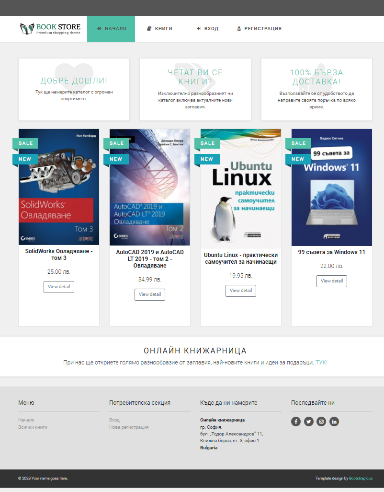
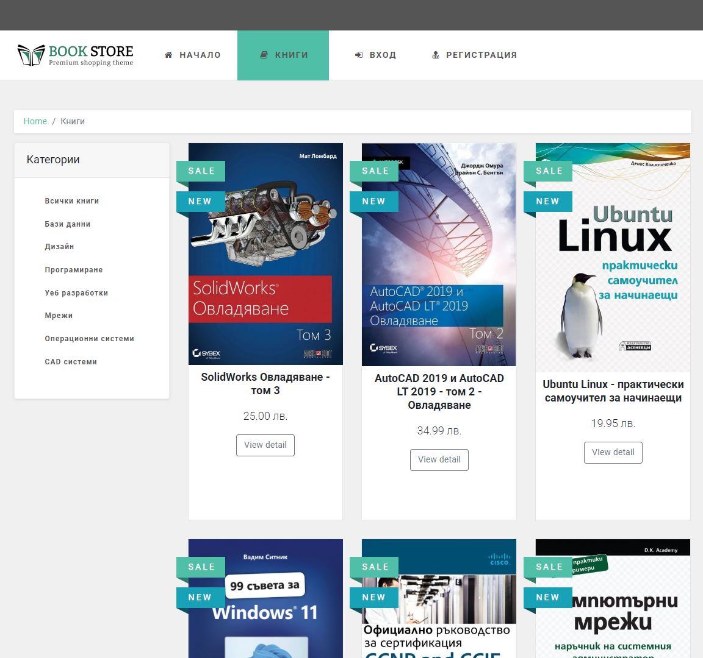
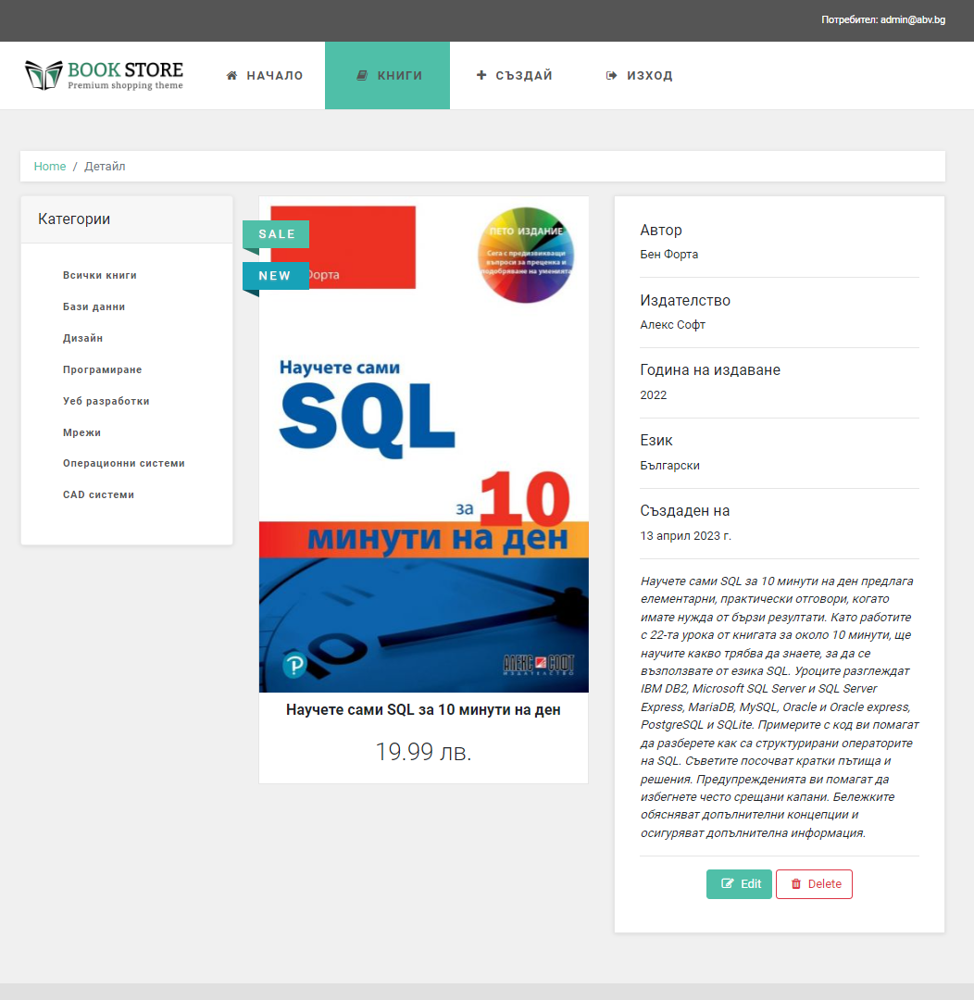
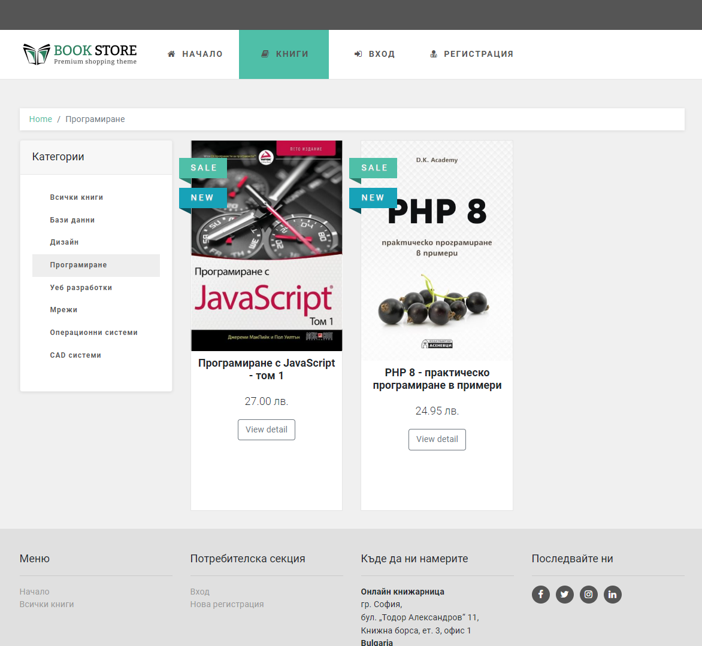
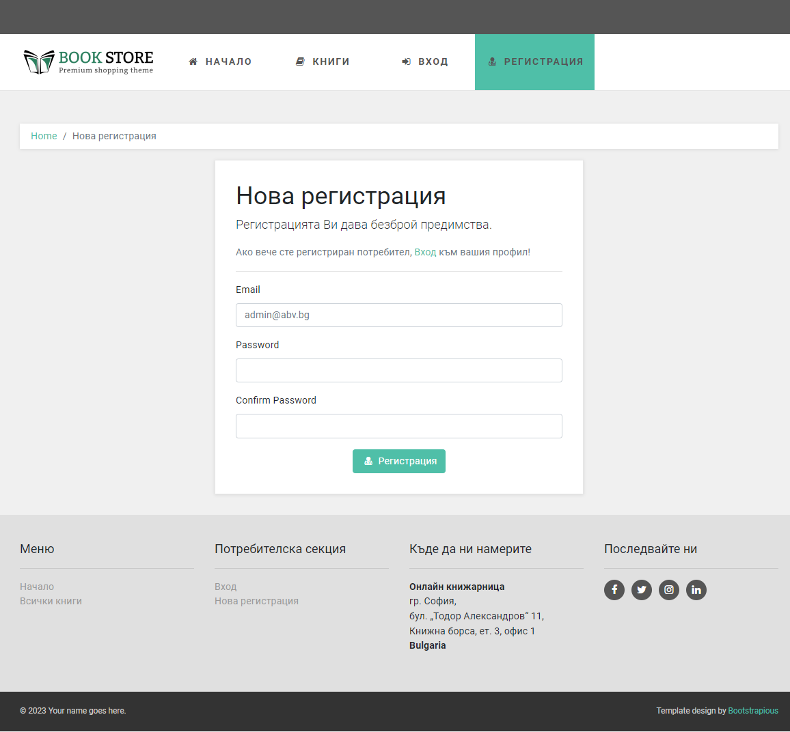
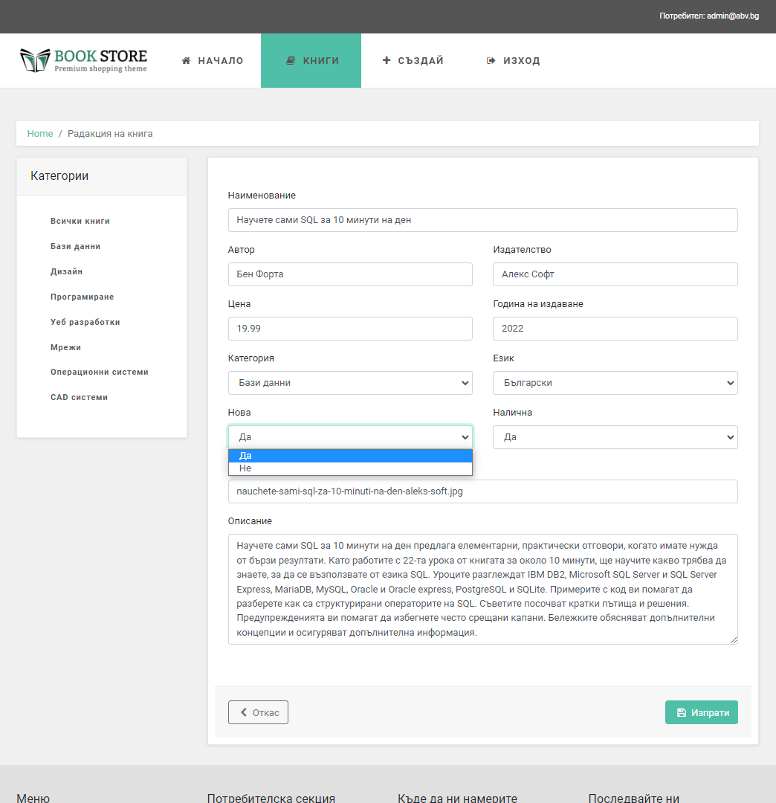
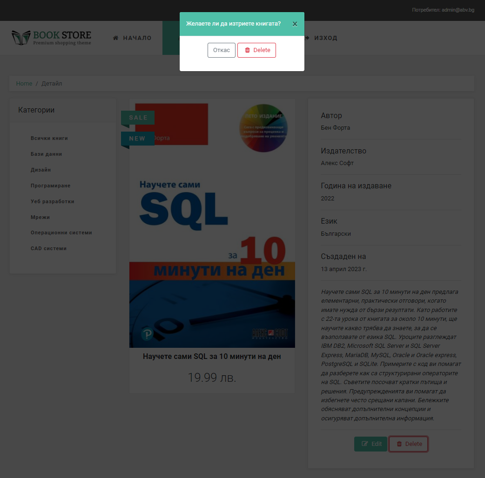
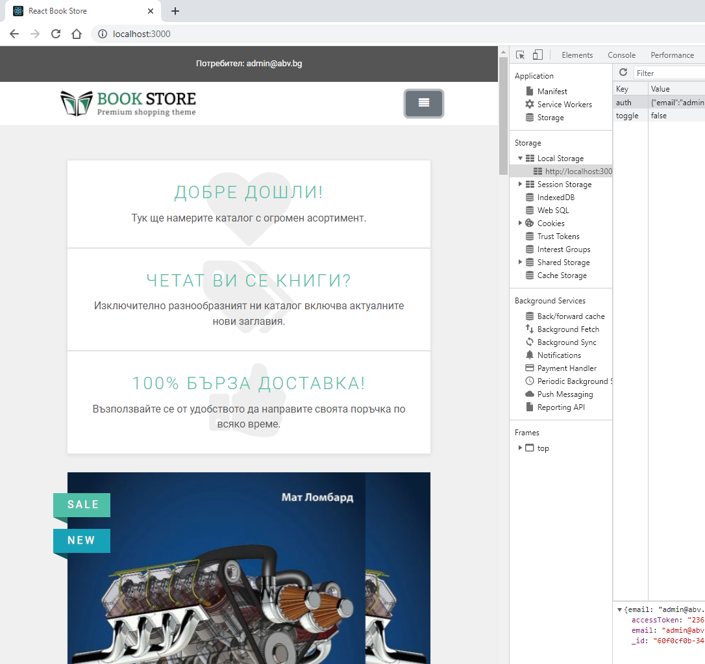
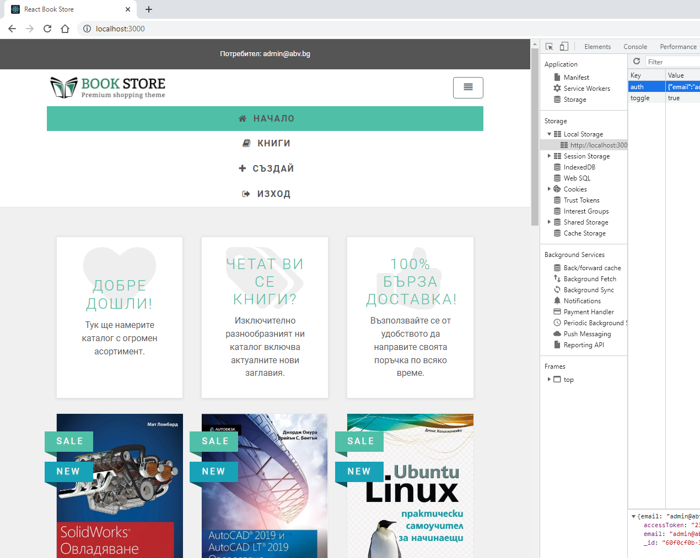
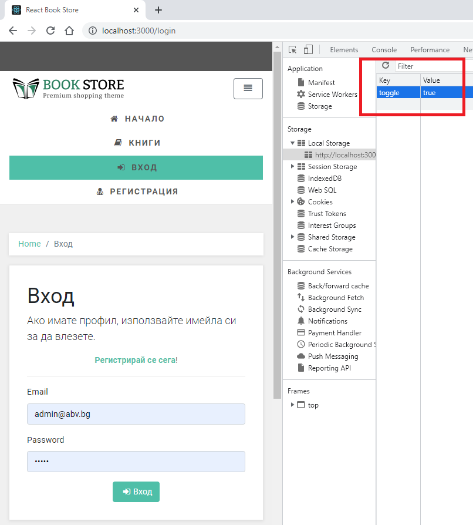

# SoftUni Project Defense

# Screenshots
### Home page with last 4 books

### Books list

### Details page

### Filter by category

### Create user

### Create-Edit Books Forms

### Delete confirm modal popup

### Responsive desing for small devices

### Responsive desing for medium devices

### Toggle menu position
