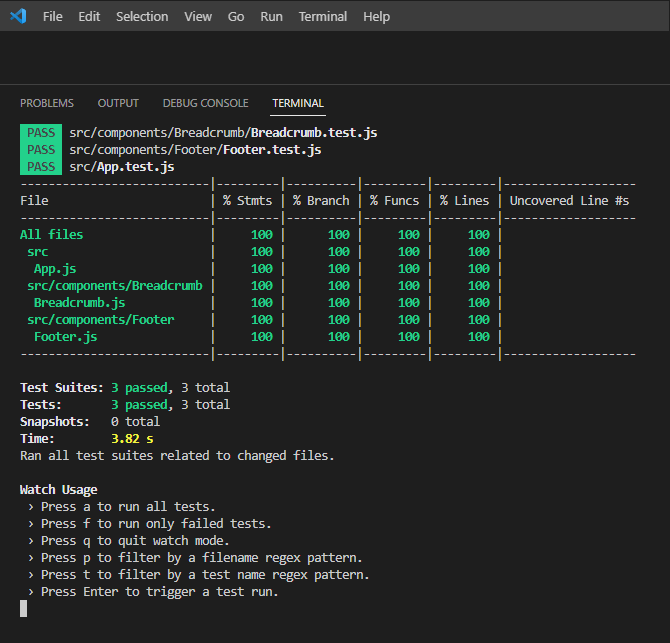

# SoftUni Project Defense

\
&nbsp;

## :hammer_and_pick: Built With
[](https://skillicons.dev)

[SoftUni practice server](https://github.com/softuni-practice-server/softuni-practice-server) as a backend solution

\
&nbsp;

# React sample code　

```javascript
import { memo } from 'react';
import { Link } from "react-router-dom";
import { useBookContext } from '../../contexts/BookContext';

const Sidebar = () => {
    const { category } = useBookContext();
    return (
        <div className="col-lg-3">
            <div className="card sidebar-menu mb-4">
                <div className="card-header">
                    <h3 className="h4 card-title">Категории</h3>
                </div>
                <div className="card-body">
                    <ul className="nav nav-pills flex-column category-menu">
                        <li>
                            <ul className="list-unstyled">
                                <li><Link to="/books">Всички книги</Link></li>
                                {category.map(x =>
                                    <li key={x._id}><Link to={`/category/${x._id}`}>{x.title}</Link></li>
                                )}
                            </ul>
                        </li>
                    </ul>
                </div>
            </div>
        </div>
    );
};

export default memo(Sidebar);
```

\
&nbsp;

# Screenshots

### Home page with last 4 books


\
&nbsp;
### Books list


\
&nbsp;
### Details page


\
&nbsp;
### Filter by category


\
&nbsp;
### Create user


\
&nbsp;
### Create-Edit Books Forms


\
&nbsp;
### Delete confirm modal popup


\
&nbsp;
### Responsive desing for small devices


\
&nbsp;
### Responsive desing for medium devices


\
&nbsp;
### Toggle menu position


\
&nbsp;

### React unit testing

